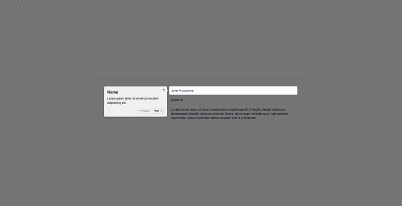

# use-driver



This is a simple plugin for using [Driver.js](https://driverjs.com/) in your [React.js](https://react.dev/) application.

## Installation

via npm:

```bash
npm install use-driver
```

via yarn:

```bash
yarn add use-driver
```

via pnpm:

```bash
pnpm add use-driver
```

## Usage

```jsx
import { useEffect } from "react";

import useDriver from "use-driver";
import "use-driver/dist/driver.css";

export default function Home() {
  const { drive, register } = useDriver();

  useEffect(() => {
    if (!drive) return;

    drive();
  }, [drive]);

  return (
    <div className="flex flex-col items-center justify-center h-screen">
      <dl className="-my-3 divide-y divide-gray-100 text-sm w-1/2 border p-8 rounded-xl">
        <div className="grid grid-cols-1 gap-1 py-3 sm:grid-cols-3 sm:gap-4">
          <dt className="font-medium text-gray-900">Name</dt>
          <dd
            {...register({
              order: 1,
              popover: {
                title: "Name",
                description:
                  "Lorem ipsum dolor sit amet consectetur adipisicing elit.",
              },
            })}
            className="text-gray-700 sm:col-span-2"
          >
            John Frusciante
          </dd>
        </div>
        <div className="grid grid-cols-1 gap-1 py-3 sm:grid-cols-3 sm:gap-4">
          <dt className="font-medium text-gray-900">Occuputation</dt>
          <dd
            {...register({
              order: 2,
              popover: {
                title: "Occuputation",
                description:
                  "Lorem ipsum dolor sit amet consectetur adipisicing elit.",
              },
            })}
            className="text-gray-700 sm:col-span-2"
          >
            Guitarist
          </dd>
        </div>
        <div className="grid grid-cols-1 gap-1 py-3 sm:grid-cols-3 sm:gap-4">
          <dt className="font-medium text-gray-900">Bio</dt>
          <dd
            {...register({
              order: 3,
              popover: {
                title: "Bio",
                description:
                  "Lorem ipsum dolor sit amet consectetur adipisicing elit.",
              },
            })}
            className="text-gray-700 sm:col-span-2"
          >
            Lorem ipsum dolor, sit amet consectetur adipisicing elit. Et facilis
            debitis explicabo doloremque impedit nesciunt dolorem facere, dolor
            quasi veritatis quia fugit aperiam aspernatur neque molestiae labore
            aliquam soluta architecto?
          </dd>
        </div>
      </dl>
    </div>
  );
}
```
